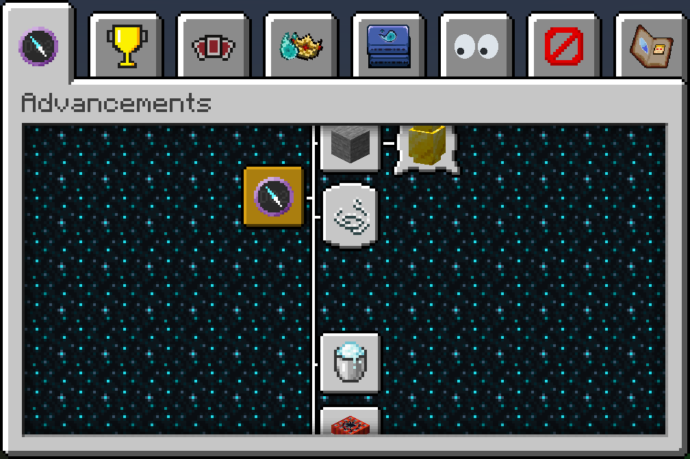

 

### File structure:
- use numbers instead of words to keep sorting the files easier
  - (two comes before one, but 1 comes before 2)
- use underscore_case for file names. It increases readability.
- use simple naming for file names, so everyone knows what that file actually is.
- keep file names in lowercase, as MC requires it.
- try to keep file name consistency even if it doesn't make sense.
  - ("win 1 times" isn't grammatically correct, but it matches every other advancement it's paired with)
- try to keep file names to stay alphabetically ordered.
  - ("difficulty_deadly" comes before "difficuly_easy", while "difficulty_1" comes before "difficulty_4" )

# Resource Pack
Required for custom model data, hopefully we can have some custom art for the majority of our advancements!

